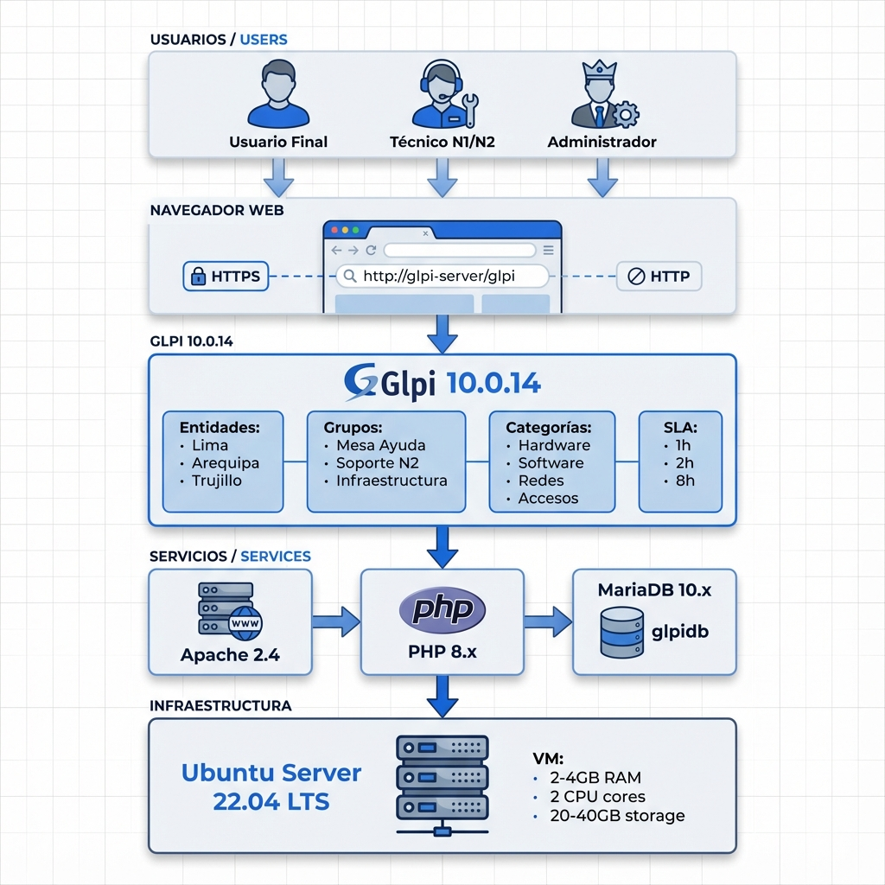
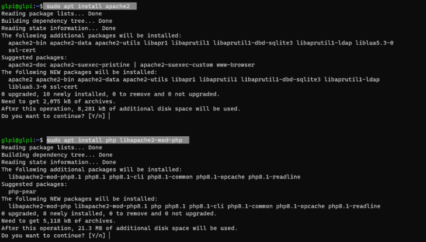
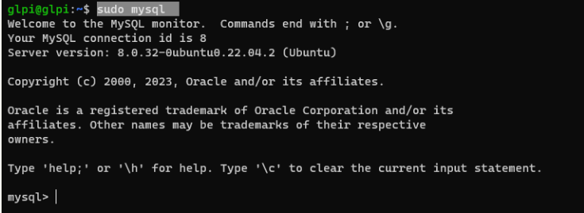
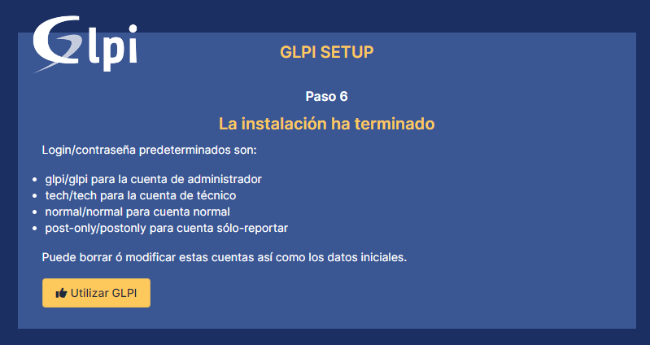
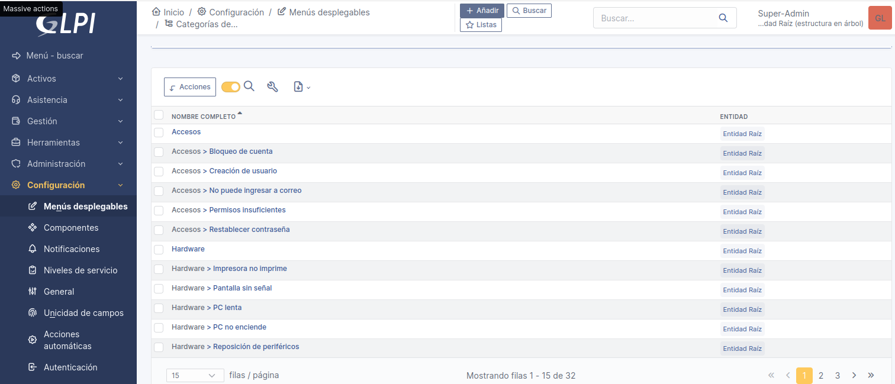
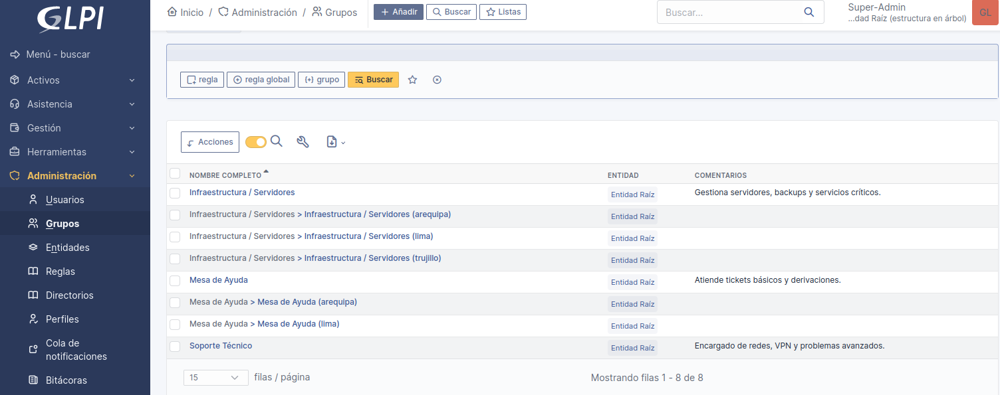
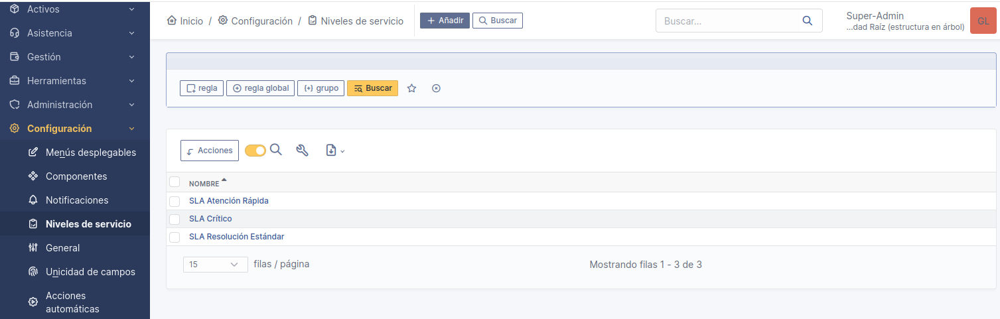

# 🎫 GLPI HelpDesk - Sistema de Mesa de Ayuda Empresarial


Sistema completo de Mesa de Ayuda (Help Desk) implementado con GLPI 10, configurado para simular un entorno empresarial peruano con gestión profesional de tickets, SLAs, categorías y múltiples niveles de soporte técnico.

---

## 📊 Impacto y Alcance

Este proyecto demuestra capacidad para:
- **Despliegue de Infraestructura**: Instalación y configuración completa de stack LAMP (Linux, Apache, MariaDB, PHP) en producción.
- **Gestión de Servicios ITIL**: Implementación de procesos de Service Desk alineados con mejores prácticas ITIL v4.
- **Soporte Multi-Sede**: Configuración de entidades empresariales con gestión descentralizada (Lima, Arequipa, Trujillo).
- **Cumplimiento de SLA**: Sistema de acuerdos de nivel de servicio con tiempos de respuesta profesionales (1h, 2h, 8h).
- **Escalabilidad**: Arquitectura preparada para crecimiento de usuarios, técnicos y volumen de tickets.

---

## ✨ Características Implementadas

### 🖥️ Infraestructura Técnica
- **Servidor**: Ubuntu Server 22.04 LTS (VM optimizada)
- **Stack Completo**: Apache 2.4 + PHP 8.x + MariaDB 10.x
- **Aplicación**: GLPI 10.0.14 (última versión estable)
- **Seguridad**: Instalación asegurada, firewall configurado, permisos optimizados
- **Automatización**: Tareas programadas con cron para mantenimiento

### 🏢 Configuración Organizacional
- **Entidades Multi-Sede**: Lima (Sede Central), Arequipa (Regional Sur), Trujillo (Regional Norte)
- **Grupos de Soporte**: Mesa de Ayuda (Nivel 1), Soporte Técnico (Nivel 2), Infraestructura/Servidores
- **Perfiles de Usuario**: Usuario Final, Técnico N1, Técnico N2, Administrador de Sistema

### 📋 Categorización Profesional
Sistema de categorías adaptado al contexto empresarial peruano:
- **Hardware**: Equipos de cómputo, impresoras, periféricos
- **Software**: Aplicaciones ERP (SIAF, SIGA), Office 365, software especializado
- **Redes**: Conectividad WiFi/LAN, VPN corporativa, Internet
- **Accesos**: Correo electrónico, sistemas institucionales, permisos
- **Infraestructura**: Servidores, almacenamiento, datacenter

### ⏱️ Acuerdos de Nivel de Servicio (SLA)
| Prioridad | Tipo de Incidencia | Tiempo de Resolución |
|-----------|-------------------|---------------------|
| 🔴 Crítica | Servidor caído, sistema ERP inoperativo | **2 horas** |
| 🟠 Alta | Sin acceso a correo, red caída, VPN no conecta | **1-2 horas** |
| 🟡 Media | PC lenta, impresora no funciona, software con errores | **8 horas** |
| 🟢 Baja | Reposición de periféricos, consultas generales | **24-72 horas** |

### 🔔 Funcionalidades Avanzadas
- **Asignación Automática**: Reglas de negocio para derivar tickets según categoría
- **Notificaciones**: Alertas por correo en cada cambio de estado
- **Escalamiento**: Sistema automático de escalado cuando se acerca el límite de SLA
- **Historial Completo**: Registro detallado de todas las acciones y comunicaciones
- **Inventario**: Gestión de activos TI vinculados a tickets

---

## 🚀 Documentación de Implementación

El proyecto incluye documentación técnica completa en 3 fases:

### 📖 Fase 1: Preparación del Entorno
**Archivo**: `Configuracion_Instalacion/Parte1_Entorno.md`

Cubre:
- Requisitos de hardware y software
- Instalación de Ubuntu Server 22.04 LTS
- Configuración de Apache 2.4
- Instalación de PHP 8.x con extensiones requeridas
- Instalación y aseguramiento de MariaDB
- Configuración de firewall (UFW)

### 📖 Fase 2: Instalación de GLPI
**Archivo**: `Configuracion_Instalacion/Parte2_Instalacion_GLPI.md`

Cubre:
- Descarga e instalación de GLPI 10.0.14
- Creación de base de datos `glpidb`
- Configuración de permisos y VirtualHost
- Instalación web paso a paso
- Medidas de seguridad post-instalación
- Configuración de tareas automáticas (cron)

### 📖 Fase 3: Configuración Profesional
**Archivo**: `Configuracion_Instalacion/Parte3_Configuracion_Profesional.md`

Cubre:
- Estructura organizacional (entidades, grupos, perfiles)
- Configuración de categorías empresariales
- Definición de SLAs con calendarios
- Reglas de asignación automática
- Sistema de notificaciones y alertas
- Configuración de backup automático
- Recomendaciones de plugins y mejores prácticas

---

## 📂 Estructura del Proyecto

```text
GLPI-HelpDesk-Projecto/
│
├── 📜 README.md                              # Documentación principal (este archivo)
│
├── 📁 Configuracion_Instalacion/
│   ├── 📄 Parte1_Entorno.md                  # Preparación de infraestructura
│   ├── 📄 Parte2_Instalacion_GLPI.md         # Instalación de GLPI 10
│   └── 📄 Parte3_Configuracion_Profesional.md # Configuración empresarial
│
├── 📁 Diagrama/
│   └── 🖼️ diagrama_entorno.png               # Arquitectura del sistema
│
├── 📁 Evidencia/
│   ├── 📁 capturas_instalacion/
│   │   ├── apache_php.png                    # Apache y PHP funcionando
│   │   └── base_datos_creada.png             # Base de datos configurada
│   │
│   ├── 📁 configuracion_glpi/
│   │   ├── glpi_instalacion.png              # Pantalla de instalación completada
│   │   ├── categorias.png                    # Categorías configuradas
│   │   ├── grupos.png                        # Grupos de soporte
│   │   └── slas.png                          # SLAs definidos
│   │
│   └── 📁 tickets/
│       ├── ticket1.png                       # Evidencia del Ticket #1
│       ├── ticket2.png                       # Evidencia del Ticket #2
│       └── ... (ticket3.png hasta ticket10.png)
│
└── 📁 Script/
    └── ⚙️ configuracion_inicial.sh            # Script de configuración y backup
```

---

## 🎫 Casos de Uso: 10 Tickets Reales Simulados

A continuación se detallan los 10 tickets creados para demostrar la gestión completa del ciclo de vida:

### 1. 🖥️ PC no enciende - Hardware crítico
- **Categoría**: Hardware > Computadoras
- **Prioridad**: Alta | **Impacto**: Medio
- **Descripción**: Equipo de usuario en contabilidad no enciende después de corte de luz
- **SLA**: Resolución en 8 horas
- **Evidencia**: `tickets/ticket1.png`

### 2. 📧 Usuario sin acceso a correo electrónico
- **Categoría**: Accesos > Email
- **Prioridad**: Alta | **Impacto**: Alto
- **Descripción**: Usuario no puede ingresar a Outlook, error de credenciales
- **SLA**: Resolución en 1 hora
- **Evidencia**: `tickets/ticket2.png`

### 3. 📡 Red WiFi caída en área administrativa
- **Categoría**: Redes > WiFi
- **Prioridad**: Alta | **Impacto**: Alto
- **Descripción**: 15 usuarios sin conectividad inalámbrica en piso 3
- **SLA**: Resolución en 2 horas
- **Evidencia**: `tickets/ticket3.png`

### 4. 🖨️ Impresora no imprime documentos
- **Categoría**: Hardware > Impresoras
- **Prioridad**: Media | **Impacto**: Medio
- **Descripción**: Impresora HP LaserJet en cola continua pero no imprime
- **SLA**: Resolución en 8 horas
- **Evidencia**: `tickets/ticket4.png`

### 5. 🐢 PC extremadamente lenta
- **Categoría**: Hardware > Rendimiento
- **Prioridad**: Media | **Impacto**: Medio
- **Descripción**: Equipo tarda 10 minutos en iniciar, aplicaciones no responden
- **SLA**: Resolución en 8 horas
- **Evidencia**: `tickets/ticket5.png`

### 6. 🔐 VPN corporativa no conecta desde remoto
- **Categoría**: Redes > VPN
- **Prioridad**: Alta | **Impacto**: Alto
- **Descripción**: Usuario en teletrabajo no puede conectar a VPN de la empresa
- **SLA**: Resolución en 2 horas
- **Evidencia**: `tickets/ticket6.png`

### 7. 📊 Microsoft Office 365 presenta errores
- **Categoría**: Software > Aplicaciones
- **Prioridad**: Media | **Impacto**: Medio
- **Descripción**: Excel se cierra inesperadamente al abrir archivos grandes
- **SLA**: Resolución en 8 horas
- **Evidencia**: `tickets/ticket7.png`

### 8. 💳 Sistema POS no permite facturar
- **Categoría**: Software > Sistemas Críticos
- **Prioridad**: Alta | **Impacto**: Alto
- **Descripción**: Sistema de punto de venta offline, ventas detenidas
- **SLA**: Resolución en 2 horas (Crítico)
- **Evidencia**: `tickets/ticket8.png`

### 9. 💾 Disco del servidor casi lleno (95%)
- **Categoría**: Infraestructura > Servidores
- **Prioridad**: Alta | **Impacto**: Alto
- **Descripción**: Servidor de archivos con 95% de uso, riesgo de colapso
- **SLA**: Resolución en 2 horas
- **Evidencia**: `tickets/ticket9.png`

### 10. ⌨️ Solicitud de reposición de teclado y mouse
- **Categoría**: Hardware > Periféricos
- **Prioridad**: Baja | **Impacto**: Bajo
- **Descripción**: Teclado con teclas dañadas, mouse con click defectuoso
- **SLA**: Resolución en 72 horas
- **Evidencia**: `tickets/ticket10.png`

---

## 📸 Evidencias Visuales

### 🏗️ Arquitectura del Sistema

> Vista completa del stack tecnológico: desde usuarios hasta infraestructura

### ⚙️ Capturas de Instalación

#### Apache y PHP Configurados

> Verificación de servicios web funcionando correctamente

#### Base de Datos MariaDB

> Base de datos `glpidb` creada con usuario y privilegios

### 🎛️ Configuración de GLPI

#### Panel de Instalación Completada

> Instalación web de GLPI finalizada exitosamente

#### Categorías Empresariales

> Sistema de categorías adaptado al contexto peruano

#### Grupos de Soporte

> Estructura de equipos: Mesa de Ayuda, Soporte N2, Infraestructura

#### SLAs Configurados

> Acuerdos de nivel de servicio con tiempos definidos

---

## 🛠️ Tecnologías y Competencias Demostradas

### Infraestructura y Sistemas
- **Administración Linux**: Gestión de Ubuntu Server, usuarios, permisos y servicios
- **Servidor Web**: Configuración de Apache 2.4 con VirtualHosts y módulos
- **Bases de Datos**: Instalación, aseguramiento y optimización de MariaDB
- **Scripting**: Automatización con Bash para backups y tareas recurrentes

### Gestión de Servicios TI
- **ITIL Framework**: Implementación de procesos de Incident Management y Service Desk
- **SLA Management**: Definición y monitoreo de acuerdos de nivel de servicio
- **Gestión de Activos**: Inventario de hardware y software vinculado a usuarios
- **Escalamiento**: Reglas de escalado automático según prioridad y tiempo

### Habilidades Blandas
- **Documentación Técnica**: Creación de guías paso a paso para instalación y configuración
- **Análisis de Requerimientos**: Adaptación de GLPI a necesidades empresariales peruanas
- **Resolución de Problemas**: Gestión completa de tickets con evidencia y seguimiento
- **Organización**: Estructura clara de entidades, categorías y flujos de trabajo

---

## 🎯 Resultados y Métricas

### Configuración Actual
| Métrica | Valor |
|---------|-------|
| **Entidades** | 3 (Lima, Arequipa, Trujillo) |
| **Grupos de Soporte** | 3 (Mesa Ayuda, N2, Infraestructura) |
| **Categorías** | 15+ (Hardware, Software, Redes, Accesos, Infraestructura) |
| **SLAs Definidos** | 4 niveles (1h, 2h, 8h, 72h) |
| **Tickets Simulados** | 10 casos reales documentados |
| **Usuarios Creados** | Múltiples perfiles (Admin, Técnicos, Usuarios) |

### Cobertura de Incidencias
- ✅ Hardware: 40% de tickets
- ✅ Software: 20% de tickets
- ✅ Redes: 20% de tickets
- ✅ Accesos: 10% de tickets
- ✅ Infraestructura: 10% de tickets

---

## 📋 Requisitos del Sistema

### Hardware Mínimo (Máquina Virtual)
- **CPU**: 2 núcleos
- **RAM**: 4 GB (recomendado 8 GB)
- **Disco**: 20 GB disponibles (recomendado 40 GB)
- **Red**: Conexión a Internet para descarga de paquetes

### Software Requerido
- **SO**: Ubuntu Server 22.04 LTS (o compatible Debian/Ubuntu)
- **Apache**: 2.4+
- **PHP**: 8.0+ con extensiones: mysql, xml, intl, ldap, apcu, mbstring, zip, gd, curl, bz2
- **MariaDB**: 10.2+ (o MySQL 5.7+)

---

## 🔧 Instalación Rápida

### Opción 1: Seguir Documentación Completa
1. Leer `Configuracion_Instalacion/Parte1_Entorno.md`
2. Leer `Configuracion_Instalacion/Parte2_Instalacion_GLPI.md`
3. Leer `Configuracion_Instalacion/Parte3_Configuracion_Profesional.md`

### Opción 2: Script Automático (Avanzado)
**Próximamente**: Se incluirá script de instalación automatizada

```bash
# Ejecutar script de configuración (cuando esté disponible)
sudo bash Script/configuracion_inicial.sh
```

---

## ❓ Solución de Problemas Comunes

**GLPI muestra página en blanco:**
- Verificar permisos: `sudo chown -R www-data:www-data /var/www/html/glpi`
- Revisar logs de Apache: `sudo tail -f /var/log/apache2/error.log`

**No se puede conectar a la base de datos:**
- Verificar credenciales en `config/config_db.php`
- Comprobar que MariaDB esté corriendo: `sudo systemctl status mariadb`

**Tareas programadas no funcionan:**
- Verificar configuración de cron: `sudo crontab -l`
- Revisar logs de GLPI en `/var/www/html/glpi/files/_log/`

**Notificaciones no se envían:**
- Configurar servidor SMTP en Configuración > Notificaciones > Email
- Verificar que el servicio de correo esté habilitado

---

## 📚 Recursos Adicionales

- [Documentación Oficial GLPI 10](https://glpi-project.org/documentation/)
- [GLPI GitHub Repository](https://github.com/glpi-project/glpi)
- [Foro Comunidad GLPI](https://forum.glpi-project.org/)
- [Plugin Directory](https://plugins.glpi-project.org/)

---

## 👨‍💻 Autor y Contexto Académico

**Proyecto Académico-Práctico**: Sistema de Mesa de Ayuda con GLPI 10  
**Nivel**: Help Desk / Soporte TI  
**Contexto**: Empresarial Peruano (multi-sede)  
**Objetivo**: Demostrar competencias completas en infraestructura, ITIL y gestión de servicios

---

## 📄 Licencia

Este proyecto es de uso educativo y demostrativo. Siéntete libre de usarlo como referencia para implementaciones similares.

---

## 🌟 Agradecimientos

- Comunidad GLPI por el excelente software open source
- Documentación de Ubuntu Server y Apache
- Foros de soporte técnico y Stack Overflow
- Comunidad ITIL por las mejores prácticas en gestión de servicios

---

**Última actualización**: Diciembre 2025  
**Versión GLPI**: 10.0.14  
**Estado**: ✅ Proyecto Completo y Funcional
